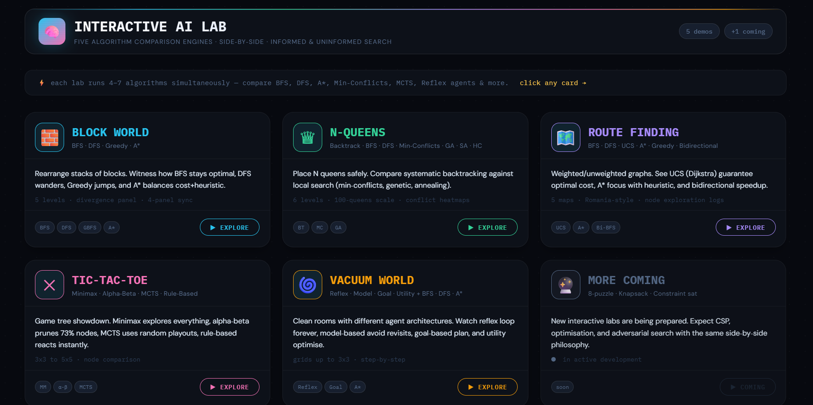

# 🧠 Interactive AI Lab

**Five side‑by‑side algorithm comparison engines** — watch BFS, DFS, A*, Min‑Conflicts, MCTS, and more **diverge in real time**.

Each lab is a standalone, self‑contained HTML page. No build, no dependencies. Built to demonstrate the behaviour of classic AI search algorithms on canonical problems. The design language is consistent: dark theme, dot grid, coloured accents per algorithm, synchronised step‑by‑step playback, and diverging explanation panels.

 <!-- You can add a screenshot later -->

---

## 📂 Repository Contents

| File | Description | Algorithms |
|------|-------------|------------|
| `BlockWorld.html` | Blocks world rearrangement – stacks, tables, optimal vs suboptimal moves | BFS, DFS, Greedy, A* |
| `NQueens.html` | N‑Queens CSP – from 4 to 100 queens | Backtrack, BFS, DFS, Min‑Conflicts, Genetic, SA, Hill Climbing |
| `RouteFinding.html` | Weighted graph search (Romania style) | BFS, DFS, UCS, A*, Greedy, Bidirectional |
| `TicTacToe.html` | Game tree search on 3x3, 4x4, 5x5 | Minimax, Alpha‑Beta, MCTS, Rule‑Based, Random |
| `VacuumWorld.html` | Agent architectures + grid search | Reflex, Model, Goal, Utility, BFS, DFS, A* |
| `dashboard.html` | Central hub – card grid with links | – |
| `README.md` | You are here | 📖 |

➕ A **coming soon** slot is reserved for future expansions (8‑puzzle, knapsack, constraint satisfaction).

---

## ✨ Common Features

All pages share the same powerful interface:

- **Level selector** – 5–6 difficulty levels, each with pre‑defined start/goal states.
- **Sync bar** – Step through all algorithms simultaneously or auto‑play.
- **Divergence panel** – First two steps explained: why each algorithm chooses differently.
- **Progress bars** – Heuristic / cost / depth visualisation.
- **Move log** – Clickable step list with active highlighting.
- **Comparison table** – Time/space/optimality reference at the bottom.

Colour coding per algorithm:  
BFS · DFS · UCS · A* · GBFS · MCTS · Min‑Conflicts · and more.

---

## 🚀 Quick Start

1. Clone the repository or download the ZIP.
2. Open **`dashboard.html`** in any modern browser (Chrome, Firefox, Edge, Safari).
3. Click any problem card to launch the corresponding visualiser.
4. Use the top bar to select level and speed.
5. Watch the algorithms run side‑by‑side, or step manually.
6. Read the **divergence panel** to understand the first two decisions.
7. Click on any move in the log to jump to that state.
8. The **sync bar** lets you control all algorithms together.

> 💡 **Tip:** Every page is completely independent – you can open multiple tabs and compare manually.

---

## 🧠 Algorithms at a Glance

| Algorithm | Type | Optimal? | Key Property |
|-----------|------|----------|--------------|
| BFS | Uninformed | ✓ (unweighted) | FIFO queue, level‑order, memory O(b^d) |
| DFS | Uninformed | ✗ | LIFO stack, low memory, can wander deep |
| UCS / Dijkstra | Uninformed (cost) | ✓ (weighted) | priority queue by g(n) |
| A* | Informed | ✓ (admissible h) | f = g + h, balances cost + heuristic |
| Greedy Best‑First | Informed | ✗ | only h(n) – fast but can be misled |
| Bidirectional BFS | Uninformed | ✓ (unweighted) | two frontiers, O(b^(d/2)) |
| Backtracking | Systematic | ✓ | constraint propagation, O(n!) worst case |
| Min‑Conflicts | Local search | ✗ (probabilistic) | iteratively reduce conflicts, scales to 100‑queens |
| Genetic Algorithm | Evolutionary | ✗ | population, crossover, mutation |
| Simulated Annealing | Probabilistic | ✗ | accepts worse moves with decreasing temperature |
| Hill Climbing | Local | ✗ | greedy, gets stuck in local minima |
| Minimax | Game tree | ✓ (perfect) | full depth, optimal opponent assumption |
| Alpha‑Beta | Game tree | ✓ (identical) | prunes 70%+ of nodes, same result |
| MCTS | Simulation | near‑optimal | UCB1 + random playouts, scalable |
| Rule‑Based | Reactive | ~ | hand‑coded priorities (win > block > centre) |
| Reflex / Model / Goal / Utility | Agent architectures | varying | memory vs planning vs optimisation |

> *Optimality depends on domain – see each page’s comparison table for details.*

---

## 🛠️ Customisation & Extending

All pages are plain HTML/CSS/JavaScript (no frameworks). To add a new level or modify an existing one, edit the `LEVELS` array inside the `<script>` of each file. Each level defines:

- start state, goal, heuristic (if needed)
- insight steps for the divergence panel
- algorithm‑specific result notes

The colour scheme is controlled by CSS variables in the `<style>` block. For a new problem domain, copy one of the existing pages and replace the state representation, successor function, and algorithm implementations. The UI components (panels, sync bar, log) are designed to be reusable.

---

## 📚 Credits & Purpose

Designed as a teaching aid for AI courses – to visually demonstrate why different algorithms make different choices, and how heuristics, pruning, and search strategies affect performance. Inspired by classic AI textbooks (Russell & Norvig, Rich & Knight).

All visualisations run locally; no data is sent to any server. Icons and fonts are from Google Fonts (IBM Plex Mono, DM Sans).

**License:** MIT – free to use, modify, and distribute.

---

## 🧪 Live Preview

You can see a hosted version (if available) or simply download and open `dashboard.html` locally.

---

*Happy experimenting!* 🚀